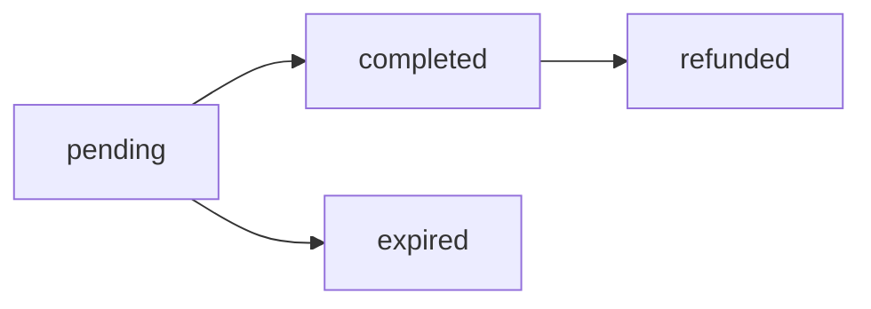

# StacksFlow Commerce Hub

[](https://stacks.co)
[](https://clarity-lang.org)
[](LICENSE)

> Enterprise-grade Bitcoin payment processing infrastructure enabling seamless sBTC transactions with automated fee distribution, merchant management, and real-time settlement capabilities.

## Overview

StacksFlow Commerce Hub revolutionizes digital commerce by providing a comprehensive payment gateway solution built on the Stacks blockchain. This smart contract empowers businesses to accept sBTC payments with enterprise-level features including automated invoice generation, multi-tier fee structures, instant settlement processing, and comprehensive merchant dashboard capabilities.

### Key Features

- 🏢 **Merchant Registration & Management** - Complete business onboarding with customizable settings
- 💰 **sBTC Payment Processing** - Seamless Bitcoin-backed transactions
- 🧾 **Invoice Generation** - Automated payment request creation with expiry management
- 📊 **Fee Distribution** - Multi-tier fee structure with platform and business fees
- 💸 **Instant Settlements** - Real-time balance updates and withdrawals
- 🔄 **Refund System** - Built-in refund mechanisms for businesses
- 🔗 **Reference Tracking** - Unique reference-based transaction tracking
- ⚡ **Webhook Support** - Integration capabilities for external systems
- 🔒 **Security Features** - Time-locked payments and balance segregation

## Architecture

### Smart Contract Components

#### Data Structures

- **Businesses**: Merchant registration and configuration data
- **Payments**: Transaction records with status tracking
- **Payment References**: Unique identifier mapping for transactions
- **Business Balances**: Segregated balance management

#### Core Functions

##### Public Functions

- `register-business` - Register a new merchant
- `update-business` - Update merchant settings
- `create-payment` - Generate payment requests
- `pay-invoice` - Process customer payments
- `withdraw-balance` - Merchant balance withdrawals
- `refund-payment` - Process refunds
- `set-platform-fee` - Admin fee management
- `set-fee-collector` - Admin fee destination

##### Read-Only Functions

- `get-payment` - Retrieve payment details
- `get-payment-by-reference` - Find payments by reference ID
- `get-business` - Get merchant information
- `get-business-balance` - Check merchant balance
- `calculate-fees` - Fee calculation utility
- `is-payment-valid` - Payment validation

## Quick Start

### Prerequisites

- [Clarinet](https://github.com/hirosystems/clarinet) - Stacks development tool
- [Node.js](https://nodejs.org/) - For testing framework
- [sBTC Token Contract](https://github.com/stacks-network/sbtc) - Required dependency

### Installation

1. **Clone the repository**

   ```bash
   git clone https://github.com/your-org/stackflow.git
   cd stackflow
   ```

2. **Install dependencies**

   ```bash
   npm install
   ```

3. **Run tests**

   ```bash
   clarinet test
   # or
   npm test
   ```

4. **Deploy to devnet**

   ```bash
   clarinet integrate
   ```

## Usage Examples

### 1. Register as a Merchant

```clarity
(contract-call? .stackflow register-business 
  "My Online Store" 
  (some "https://mystore.com/webhook"))
```

### 2. Create a Payment Request

```clarity
(contract-call? .stackflow create-payment
  u1000000  ;; 1 sBTC (in satoshis)
  "Premium Subscription - 1 Year"
  "invoice-12345"
  u144)     ;; Expires in 144 blocks (~24 hours)
```

### 3. Process Payment (Customer)

```clarity
(contract-call? .stackflow pay-invoice u1)  ;; Payment ID
```

### 4. Withdraw Funds (Merchant)

```clarity
(contract-call? .stackflow withdraw-balance u950000)  ;; Amount after fees
```

## Fee Structure

The platform implements a dual-fee system:

- **Platform Fee**: Default 1% (100 basis points) - configurable by admin
- **Business Fee**: Custom per merchant (0-10%) - set by individual businesses
- **Fee Calculation**: Fees are deducted from payment amount before crediting merchant

### Example Fee Calculation

For a 1 sBTC payment with 1% platform fee and 2.5% business fee:

- Platform Fee: 0.01 sBTC
- Business Fee: 0.025 sBTC
- Net to Merchant: 0.965 sBTC

## API Reference

### Error Codes

| Code | Constant | Description |
|------|----------|-------------|
| 100 | `ERR_UNAUTHORIZED` | Unauthorized access |
| 101 | `ERR_INVALID_AMOUNT` | Invalid amount or parameter |
| 102 | `ERR_PAYMENT_NOT_FOUND` | Payment does not exist |
| 103 | `ERR_PAYMENT_ALREADY_PROCESSED` | Payment already completed |
| 104 | `ERR_PAYMENT_EXPIRED` | Payment has expired |
| 105 | `ERR_INSUFFICIENT_BALANCE` | Insufficient balance |
| 106 | `ERR_BUSINESS_NOT_REGISTERED` | Business not registered |
| 107 | `ERR_INVALID_SIGNATURE` | Invalid signature |

### Payment Status Flow



### Data Types

#### Business Record

```clarity
{
  name: (string-ascii 64),
  webhook-url: (optional (string-ascii 256)),
  fee-rate: uint,
  is-active: bool,
  total-processed: uint,
  registration-block: uint
}
```

#### Payment Record

```clarity
{
  business: principal,
  customer: (optional principal),
  amount: uint,
  description: (string-ascii 256),
  reference-id: (string-ascii 64),
  status: (string-ascii 16),
  created-at: uint,
  expires-at: uint,
  processed-at: (optional uint),
  processor: (optional principal)
}
```

## Testing

The project includes comprehensive test coverage:

```bash
# Run all tests
npm test

# Run contract validation
clarinet check

# Run specific test file
npx vitest tests/stackflow.test.ts
```

### Test Coverage

- ✅ Business registration and management
- ✅ Payment creation and processing
- ✅ Fee calculations and distributions
- ✅ Balance management and withdrawals
- ✅ Refund processing
- ✅ Error handling and edge cases
- ✅ Security validations

## Configuration

### Network Settings

Configure for different networks in `settings/`:

- `Devnet.toml` - Local development
- `Testnet.toml` - Stacks testnet
- `Mainnet.toml` - Production deployment

### Environment Variables

```toml
[contracts.stackflow]
path = "contracts/stackflow.clar"
clarity_version = 2
epoch = "2.4"
```

## Security Considerations

### Best Practices Implemented

- ✅ **Input Validation**: All parameters validated before processing
- ✅ **Access Control**: Role-based permissions for admin functions
- ✅ **Reentrancy Protection**: Safe external contract calls
- ✅ **Balance Segregation**: Isolated merchant balances
- ✅ **Time-lock Validation**: Payment expiry enforcement
- ✅ **Reference Uniqueness**: Prevents duplicate transactions

### Audit Recommendations

1. **External Security Audit**: Recommended before mainnet deployment
2. **Formal Verification**: Consider mathematical proof of critical functions
3. **Gradual Rollout**: Start with limited merchants and transaction volumes
4. **Monitoring**: Implement comprehensive logging and alerting

## Contributing

We welcome contributions! Please see our [Contributing Guidelines](CONTRIBUTING.md) for details.

### Development Workflow

1. Fork the repository
2. Create a feature branch
3. Make your changes
4. Add tests for new functionality
5. Ensure all tests pass
6. Submit a pull request

### Code Standards

- Follow Clarity best practices
- Maintain test coverage above 90%
- Document all public functions
- Use descriptive variable names

## Roadmap

### Phase 1 (Current)

- ✅ Core payment processing
- ✅ Merchant management
- ✅ Basic fee structure

### Phase 2 (Q2 2025)

- 🔄 Multi-signature support
- 🔄 Advanced webhook system
- 🔄 Subscription payments

### Phase 3 (Q3 2025)

- 📋 Governance token integration
- 📋 Cross-chain compatibility
- 📋 Mobile SDK

## License

This project is licensed under the MIT License - see the [LICENSE](LICENSE) file for details.

## Acknowledgments

- [Stacks Foundation](https://stacks.org) - For the blockchain infrastructure
- [sBTC Working Group](https://github.com/stacks-network/sbtc) - For Bitcoin integration
- [Clarity Language](https://clarity-lang.org) - For the smart contract language
